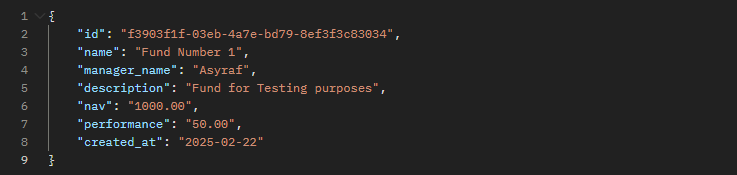
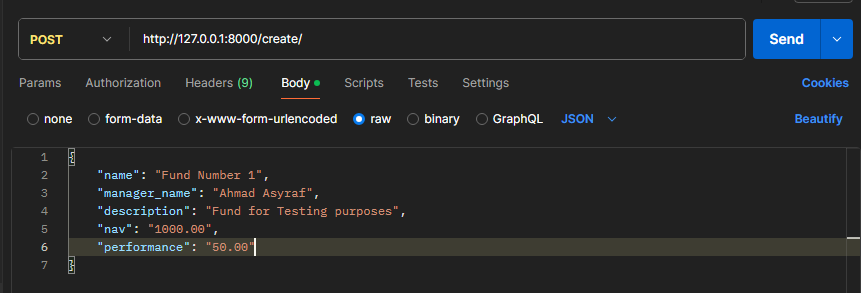
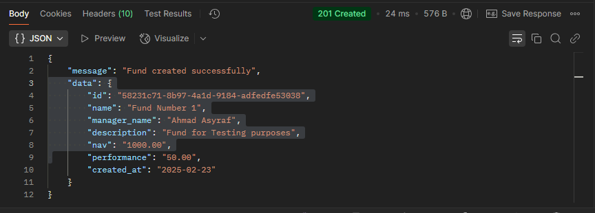
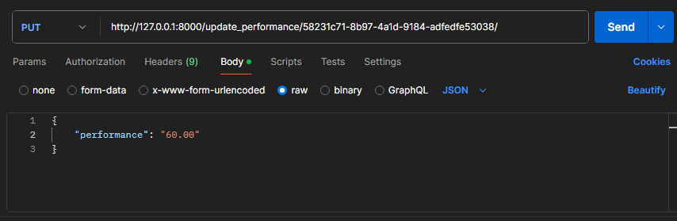
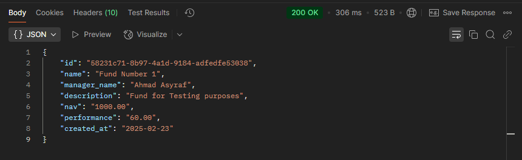
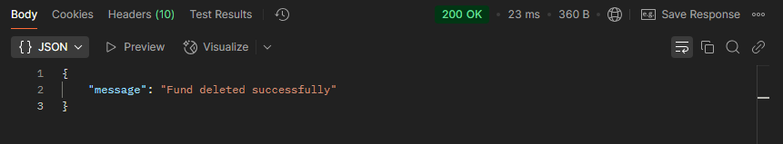

# Fund Management System
The purpose of this assessment is to evaluate the candidate's proficiency as a backend developer with a focus on Python and their understanding of building and working  with RESTful APIs. The assessment aims to assess the candidate's ability to design, develop, and maintain scalable and efficient backend solutions for a fund management  company.  
For each task, please access these files to evaluate: 
Task 1: [fundapp/models.py](https://github.com/asyraphile/fund_mgt_sys/blob/main/fundapp/models.py)  
Task 2: [fundapp/views.py](https://github.com/asyraphile/fund_mgt_sys/blob/main/fundapp/views.py)  
Task 3: Installation step 6  
Task 4: In Django, it is not needed to use SQL statements to create tables and relationships in database as it is done in Task 1 and Installation step 6. But I have prepared an SQL statements if you still need it. Refer to task4.sql in this repository.  
Task 5: Please ensure you have completed all installation steps and refer to task5.sql in this repository to manually insert data into the table.  
Task 6: [fundapp/views.py](https://github.com/asyraphile/fund_mgt_sys/blob/main/fundapp/views.py)  
Task 7: [fundapp/tests.py](https://github.com/asyraphile/fund_mgt_sys/blob/main/fundapp/tests.py)
  
Please note that for this assessment I will be using only development server to run the system.

## Acknowledgements
Task 8: Documentation Provide clear and concise documentation for the API and the SQL database, including how to interact with each endpoint, SQL schema, and sample requests and responses.

 - [Installation](#Installation)
 - [API Endpoints](#api-endpoints)
 - [Usage](#usage)
 - [Run Unit Test](#unit-tests)

## Installation

1. Python 3.10 and above installed on your computer.
2. Open command prompt in this directory or navigate into this directory.
3. Create a virtual environment by running "python -m venv venv"
4. Once venv is created, run ".\venv\Scripts\activate" to activate the virtual environment.
5. Install required libraries to run the system by running "pip install -r requirements.txt".
6. Run "python manage.py migrate" to migrate changes. This will create db.sqlite3 in your local computer and create tables in the database.
7. Run "python manage.py runserver" to start the development server.

## API Endpoints

1. http://localhost:8000/all/ on GET
2. http://localhost:8000/fund/fund-id/ on GET
3. http://localhost:8000/create/ on POST
4. http://localhost:8000/update_performance/fund-id/ on PUT
5. http://localhost:8000/delete/fund-id/ on DELETE

## Usage
Please make sure that you have started the server before using these endpoint by running "python manage.py runserver". You may use Postman or Curl to run these endpoints.

Once the server is running, this will be displayed in the terminal: 
System check identified no issues (0 silenced). 
February 23, 2025 - 13:45:26 
Django version 5.1.6, using settings 'fundms.settings' 
Starting development server at http://127.0.0.1:8000/ 
Quit the server with CTRL-BREAK. 

### 1. http://localhost:8000/all/ - List all funds
### How to interact:
This endpoint will display all funds that have been registered into the database. 
<b>Sample Request</b>: http://localhost:8000/all/  METHOD: GET 
<b>Sample Response</b>:  
 
### 2. http://localhost:8000/fund/fund-id/ - Get Fund by Id
### How to interact:
This endpoint will display a specific fund by id provided in the parameter. Please replace the uuid with the id provided in endpoint 1. 
<b>Sample Request</b>: http://localhost:8000/fund/f3903f1f-03eb-4a7e-bd79-8ef3f3c83034/  METHOD: GET 
<b>Sample Response</b>:  
  
### 3. http://localhost:8000/create/ - Create a Fund
### How to interact:
This endpoint will create fund based on the data given in request body. 
<b>Sample Request</b>: http://localhost:8000/create/  METHOD: POST 
<b>Sample Body(json)</b>:  
  
<b>Sample Response</b>:  
  
### 4. http://localhost:8000/update_performance/fund-id/ - Update performance of fund by Id
### How to interact:
This endpoint will update performance of the fund by id given in the parameter. Please replace the id of the fund existing/newly created fund in endpoint 1 or endpoint 3. 
<b>Sample Request</b>: http://localhost:8000/update_performance/58231c71-8b97-4a1d-9184-adfedfe53038/  METHOD: PUT 
<b>Sample Body(json)</b>:  
  
<b>Sample Response</b>:  
 
### 5. http://localhost:8000/delete/fund-id/ - Delete Fund by Id
### How to interact:
This endpoint will delete the fund by id provided in the parameter. Please replace the uuid with the existing id in endpoint 1 or 3. 
<b>Sample Request</b>: http://localhost:8000/delete/58231c71-8b97-4a1d-9184-adfedfe53038/  METHOD: DELETE 
<b>Sample Response</b>:  
  

## Run Unit Test
In order to run unit test for this system, you will need to complete the installation steps.
 
<b>To run the unit test that I have wrote in fundapp/tests.py, please ensure the developement server is not running. If it is running, you may cancel the process in the terminal by pressing Ctrl + C.</b>  
<b>Then run "python manage.py test --verbosity=2"</b>