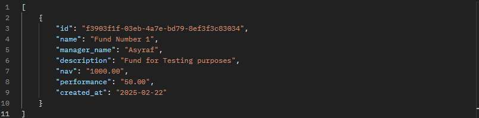

# Fund Management System
The purpose of this assessment is to evaluate the candidate's proficiency as a backend developer with a focus on Python and their understanding of building and working  with RESTful APIs. The assessment aims to assess the candidate's ability to design, develop, and maintain scalable and efficient backend solutions for a fund management  company.

Please note that for this assessment I will be using only development server to run the system.

## Acknowledgements
Task 8: Documentation Provide clear and concise documentation for the API and the SQL database, including how to interact with each endpoint, SQL schema, and sample requests and responses.

 - [Installation](#Installation)
 - [API Endpoints](#api-endpoints)
 - [Run Unit Test](#unit-tests)

## Installation

1. Python 3.10 and above installed on your computer.
2. Open command prompt in this directory or navigate into this directory.
3. Create a virtual environment by running "python -m venv venv"
4. Once venv is created, run ".\venv\Scripts\activate" to activate the virtual environment.
5. Install required libraries to run the system by running "pip install -r requirements.txt".
6. Run "python manage.py runserver" to start the development server.

## API Endpoints

1. http://localhost:8000/all/ on GET
2. http://localhost:8000/fund/fund-id/ on GET
3. http://localhost:8000/create/ on POST
4. http://localhost:8000/update_performance/fund-id/ on PUT
5. http://localhost:8000/delete/fund-id/ on DELETE
## Usage
Please make sure that you have started the server before using these endpoint by running "python manage.py runserver". You may use Postman or Curl to run these endpoints.

Once the server is running, this will be displayed in the terminal: 
System check identified no issues (0 silenced). 
February 23, 2025 - 13:45:26 
Django version 5.1.6, using settings 'fundms.settings' 
Starting development server at http://127.0.0.1:8000/ 
Quit the server with CTRL-BREAK. 

1. http://localhost:8000/all/ - List all funds
### How to interact:
This endpoint will display all funds that have been registered into the database. 
Sample Request: http://localhost:8000/all/ METHOD: GET 
Sample Response:  

2. http://localhost:8000/fund/fund-id/ on GET
3. http://localhost:8000/create/ on POST
4. http://localhost:8000/update_performance/fund-id/ on PUT
5. http://localhost:8000/delete/fund-id/ on DELETE
